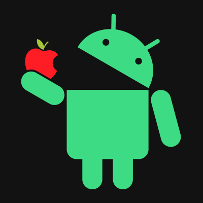

# About Me

**I'm an Android developer with a focus on crafting beautiful and efficient user experiences.**

**My Tech Stack:**

**Let's Connect!**

 [Your GitHub Profile Link](https://github.com/yourusername)
 [Your Twitter Handle](https://twitter.com/yourhandle)
 [Your LinkedIn Profile Link](https://www.linkedin.com/in/yourname)

**Feel free to reach out if you have any questions or want to collaborate on a project!**
